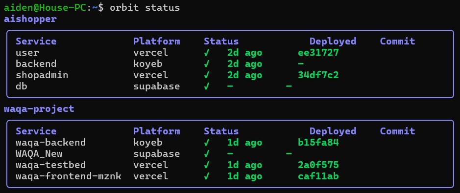

# Orbit

<p align="center">
  
</p>

**Tired of switching between the Vercel dashboard, Koyeb console, and Supabase panel just to check if your deploy went through?**

Orbit is an open-source CLI that gives you a unified view of services scattered across multiple cloud platforms. It's built for the Vibe Coding era — where AI coding assistants like Claude Code and Cursor handle the entire workflow from `git push` to deploy verification to error resolution, without a human ever opening a dashboard. Push, watch, analyze, fix — all in one flow.

Supports Vercel, Koyeb, and Supabase. Built for indie developers and small teams.

## Install

**Linux / macOS:**

```bash
source <(curl -sSL https://raw.githubusercontent.com/humanetools/orbit/main/install.sh)
```

**Homebrew (macOS):**

```bash
brew install humanetools/tap/orbit
```

**Go install:**

```bash
go install github.com/humanetools/orbit@latest
```

**From source:**

```bash
git clone https://github.com/humanetools/orbit.git
cd orbit
make build
```

## Quick Start

Run `orbit init` to get started with an interactive setup wizard:

```bash
orbit init
```

**Step 1 — Welcome**
```
╭─────────────────────────────────────────────────────────╮
│                                                         │
│  🚀 Welcome to Orbit                                   │
│                                                         │
│  Orbit helps you monitor services across cloud          │
│  platforms. This wizard will walk you through            │
│  connecting your platforms, discovering services,        │
│  and creating your first project.                       │
│                                                         │
│  Press Enter to get started...                          │
│                                                         │
╰─────────────────────────────────────────────────────────╯
```

**Step 2 — Select platforms to connect**
```
╭─────────────────────────────────────────────────────────╮
│  Select platforms to connect                            │
│                                                         │
│  > [x] Koyeb                                            │
│    [x] Supabase                                         │
│    [x] Vercel                                           │
│                                                         │
│  ↑/↓ move • Space select • Enter confirm                │
╰─────────────────────────────────────────────────────────╯
```

**Step 3 — Enter API tokens (per platform)**
```
╭─────────────────────────────────────────────────────────╮
│  Connect Vercel (1/3)                                   │
│                                                         │
│  Get your token at: https://vercel.com/tokens           │
│                                                         │
│  API Token: ••••••••••••••••••••••••••••••••             │
│                                                         │
│  Enter to validate • Ctrl+C to quit                     │
╰─────────────────────────────────────────────────────────╯
```

**Step 4 — Name your project**
```
╭─────────────────────────────────────────────────────────╮
│  Name your project                                      │
│                                                         │
│  ✓ Koyeb                                                │
│  ✓ Supabase                                             │
│  ✓ Vercel                                               │
│  7 services discovered across 3 platforms               │
│                                                         │
│  Project name: myshop                                   │
│                                                         │
│  Enter to continue                                      │
╰─────────────────────────────────────────────────────────╯
```

**Step 5 — Select services to monitor**
```
╭─────────────────────────────────────────────────────────╮
│  Select services to monitor                             │
│                                                         │
│  > [x] frontend (vercel)                                │
│    [x] backend (koyeb)                                  │
│    [x] db (supabase)                                    │
│    [ ] staging-frontend (vercel)                        │
│                                                         │
│  ↑/↓ move • Space toggle • Enter confirm                │
╰─────────────────────────────────────────────────────────╯
```

**Step 6 — Done!**
```
╭─────────────────────────────────────────────────────────╮
│                                                         │
│  🚀 Setup complete!                                     │
│                                                         │
│  Project: myshop                                        │
│                                                         │
│  Platforms:                                             │
│    ✓ Koyeb                                              │
│    ✓ Supabase                                           │
│    ✓ Vercel                                             │
│                                                         │
│  Services: 3 monitored                                  │
│                                                         │
│  Run orbit status to see your services.                 │
│                                                         │
│  Press any key to exit                                  │
│                                                         │
╰─────────────────────────────────────────────────────────╯
```

Or connect platforms individually:

```bash
orbit connect vercel
orbit connect koyeb
orbit connect supabase

# Check everything at a glance
orbit status
```

## Commands

### Monitoring

| Command | Description |
|---------|-------------|
| `orbit status` | Overview of all projects |
| `orbit status <project>` | Detailed metrics for a project |
| `orbit status <project> --service api` | Single service detail card |
| `orbit logs <project> --service api` | View service logs |
| `orbit logs <project> --service api -f` | Stream logs in real time |

### Deployments

| Command | Description |
|---------|-------------|
| `orbit deploys <project>` | Deployment history |
| `orbit watch <project> --service api` | Watch for new deploys after a push |
| `orbit redeploy <project> --service api` | Trigger a redeployment |
| `orbit rollback <project> --service api` | Rollback to previous deployment |

### Scaling (Koyeb)

| Command | Description |
|---------|-------------|
| `orbit scale <project> --service api` | View current scaling config |
| `orbit scale <project> --service api --min 3` | Set minimum instances |
| `orbit scale <project> --service api --type small` | Change instance type |

### Platform Management

| Command | Description |
|---------|-------------|
| `orbit init` | Interactive setup wizard |
| `orbit connect <platform>` | Connect a platform with API token |
| `orbit connections` | List connected platforms |
| `orbit disconnect <platform>` | Remove a platform connection |

## Watch + CI/CD

`orbit watch` is designed for use with CI/CD pipelines and AI coding assistants. Push code, then watch the deployment:

```bash
git push origin main
orbit watch myshop --service api --format json
```

Exit codes tell you what happened:

| Code | Meaning |
|------|---------|
| 0 | Deploy successful |
| 1 | Build/deploy failed |
| 2 | No new deployment detected |
| 3 | Timeout |

JSON output includes deploy ID, commit, duration, error logs — everything needed for automated responses.

## Supported Platforms

| Platform | Status | Logs | Deploys | Scale | Watch |
|----------|--------|------|---------|-------|-------|
| **Vercel** | Health, metrics | Build events | Full history | Auto (N/A) | Polling |
| **Koyeb** | Health, metrics | Runtime (SSE) | Full history | Min/max, instance type | Polling |
| **Supabase** | Health check | Dashboard only | N/A | N/A | N/A |

## Configuration

Orbit stores config in `~/.orbit/`:

- `config.yaml` — projects, platform tokens (AES-256 encrypted), thresholds
- `key` — encryption key (auto-generated, permissions 0600)

```yaml
default_project: myshop
platforms:
  vercel:
    token: "ENC:..."
  koyeb:
    token: "ENC:..."
projects:
  myshop:
    topology:
      - name: frontend
        platform: vercel
        id: "prj_xxxx"
      - name: api
        platform: koyeb
        id: "svc_xxxx"
      - name: db
        platform: supabase
        id: "ref_xxxx"
thresholds:
  response_time_ms: 500
  cpu_percent: 80
  memory_percent: 85
```

## Project Structure

```
orbit/
├── cmd/                     # Cobra commands
│   ├── root.go
│   ├── init.go              # Interactive setup wizard
│   ├── status.go            # orbit status
│   ├── logs.go              # orbit logs
│   ├── watch.go             # orbit watch
│   ├── deploys.go           # orbit deploys
│   ├── redeploy.go          # orbit redeploy
│   ├── rollback.go          # orbit rollback
│   ├── scale.go             # orbit scale
│   ├── connect.go           # orbit connect
│   ├── connections.go       # orbit connections
│   └── disconnect.go        # orbit disconnect
├── internal/
│   ├── config/              # Config + AES-256 encryption
│   ├── platform/            # Platform adapters (Vercel, Koyeb, Supabase)
│   ├── ui/                  # TUI components (Lipgloss, Bubbletea)
│   └── version/             # Build version info
├── main.go
├── Makefile
└── go.mod
```

## License

Apache License 2.0 — see [LICENSE](LICENSE) for details.
